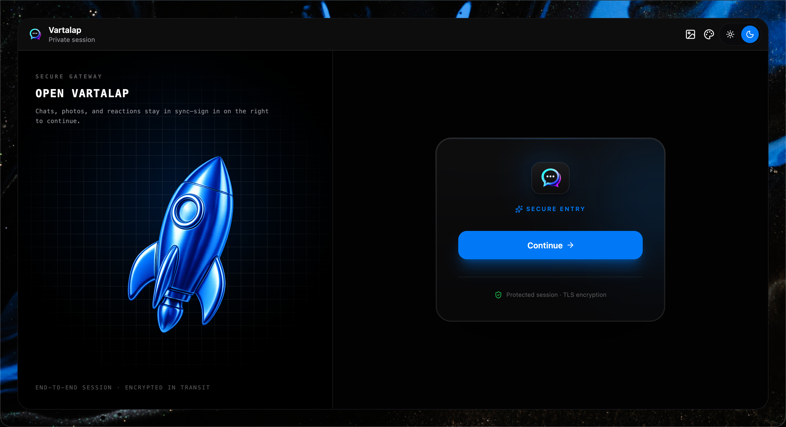
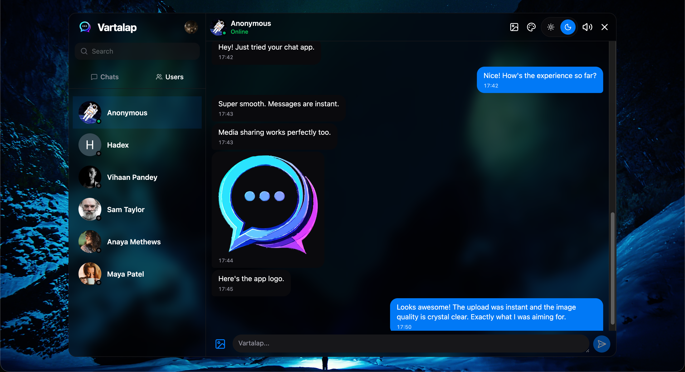

# 💬 Vartalap — Real-Time Chat Application

> A modern full-stack real-time chat application built with the MERN ecosystem, featuring secure authentication, instant messaging, media sharing, customizable themes, and a production-ready architecture.

---

## 📸 Preview

> Add screenshots or a GIF here.

### Auth-Page


### Vartalap-Page


---

## ✨ Features

- 💬 Real-Time One-to-One Messaging
- ⚡ Instant updates using Socket.io
- 🔐 Secure Authentication with Clerk
- 🟢 Live Online User Status
- 📷 Image Sharing
- 🎥 Video Sharing
- ☁️ Media Upload & Optimization using ImageKit
- 🌙 Light & Dark Mode
- 🎨 11 Beautiful UI Themes
- 🖼️ 13 Custom Chat Wallpapers
- 🔊 Optional Keyboard Sound Effects
- 🔍 Search Users & Conversations
- 📱 Responsive Design
- ⚙️ Production-ready Backend Architecture
- 🔄 Real-Time WebSocket Communication
- 🧩 Express Middleware
- ⏰ Cron Job Integration
- 🔔 Clerk Webhook Integration
- 📂 File Upload Handling
- 🌐 Ready for Deployment

---

# 🚀 Tech Stack

## Frontend

- React.js
- Tailwind CSS
- Hero UI
- Zustand
- Axios
- Socket.io Client
- Clerk Authentication

## Backend

- Node.js
- Express.js
- MongoDB
- Mongoose
- Socket.io
- Clerk
- ImageKit
- Multer
- Cron Jobs

## Deployment

- Frontend — Render
- Backend — Render
- Database — MongoDB Atlas

---

# 📁 Project Structure

```
VARTALAP
│
├── frontend
│   ├── src
│   ├── public
│   └── ...
│
├── backend
│   ├── src
│   │   ├── controllers
│   │   ├── routes
│   │   ├── models
│   │   ├── middlewares
│   │   ├── lib
│   │   └── webhooks
│   └── ...
│
└── README.md
```

---

# ⚙️ Environment Variables

## Backend (`/backend/.env`)

```env
PORT=3000

NODE_ENV=development

MONGO_URI=your_mongodb_connection_string

CLERK_PUBLISHABLE_KEY=your_clerk_publishable_key
CLERK_SECRET_KEY=your_clerk_secret_key
CLERK_WEBHOOK_SIGNING_SECRET=your_webhook_secret

IMAGEKIT_PUBLIC_KEY=your_public_key
IMAGEKIT_PRIVATE_KEY=your_private_key
IMAGEKIT_URL_ENDPOINT=your_url_endpoint

FRONTEND_URL=http://localhost:5173
```

---

## Frontend (`/frontend/.env`)

```env
VITE_CLERK_PUBLISHABLE_KEY=your_clerk_publishable_key
VITE_API_URL=http://localhost:3000
```

---

# 🛠️ Installation

## Clone the Repository

```bash
git clone https://github.com/suyashsinghx/VARTALAP.git
```

```bash
cd vartalap
```

---

## Install Dependencies

### Backend

```bash
cd backend
npm install
```

### Frontend

```bash
cd frontend
npm install
```

---

## Seed Demo Users

```bash
cd backend
npm run db:seed
```

---

## Run Backend

```bash
npm run dev
```

---

## Run Frontend

```bash
cd frontend
npm run dev
```

---

# 📌 Future Improvements

- ✅ Group Chats
- ✅ Voice Messages
- ✅ Emoji Picker
- ✅ Typing Indicator
- ✅ Push Notifications

---

# 🎯 Learning Outcomes

This project demonstrates practical experience with:

- Full Stack MERN Development
- REST API Design
- Authentication & Authorization
- WebSocket Communication
- Real-Time Systems
- MongoDB Data Modeling
- State Management with Zustand
- File Uploads
- Media Optimization
- Deployment
- Production Project Structure

---

# 🤝 Contributing

Contributions, suggestions and improvements are welcome.

Feel free to fork the repository and submit a pull request.

---

# 📄 License

This project is licensed under the MIT License.

---

# 👨‍💻 Author

**Suyash Singh**

GitHub: https://github.com/suyashsinghx

LinkedIn: https://linkedin.com/in/suyashsingh04

---

⭐ If you found this project useful, consider giving it a star!